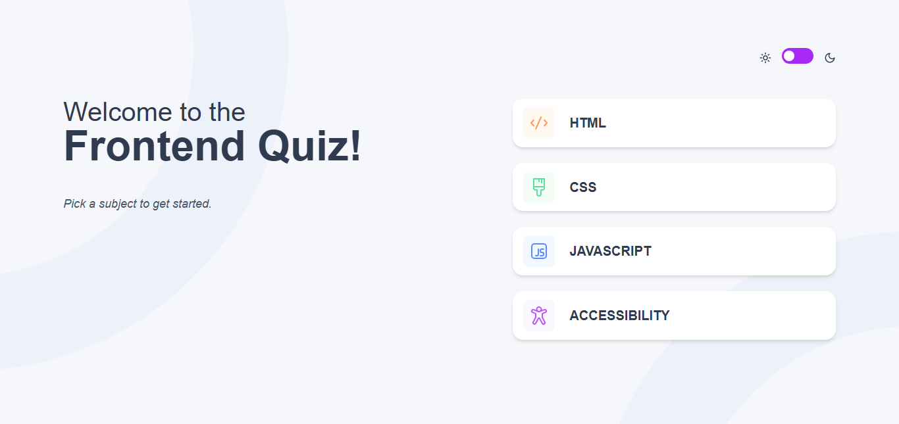
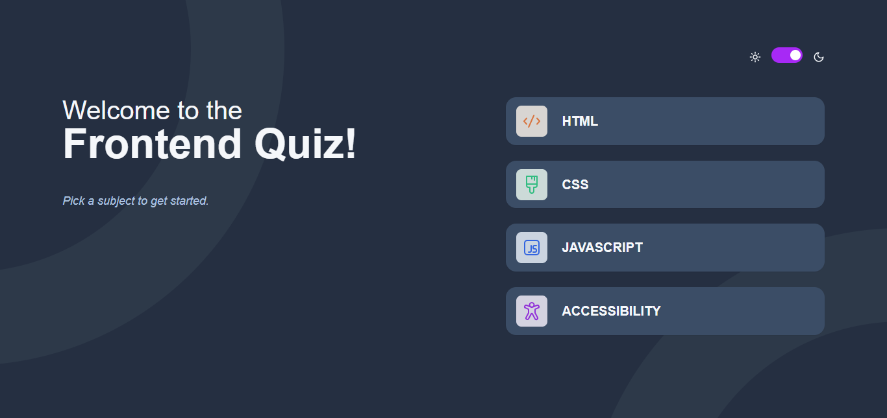
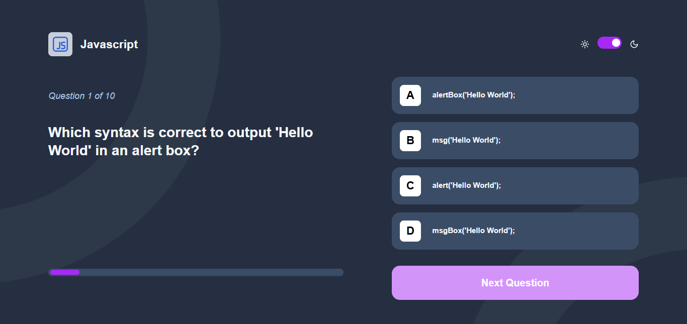
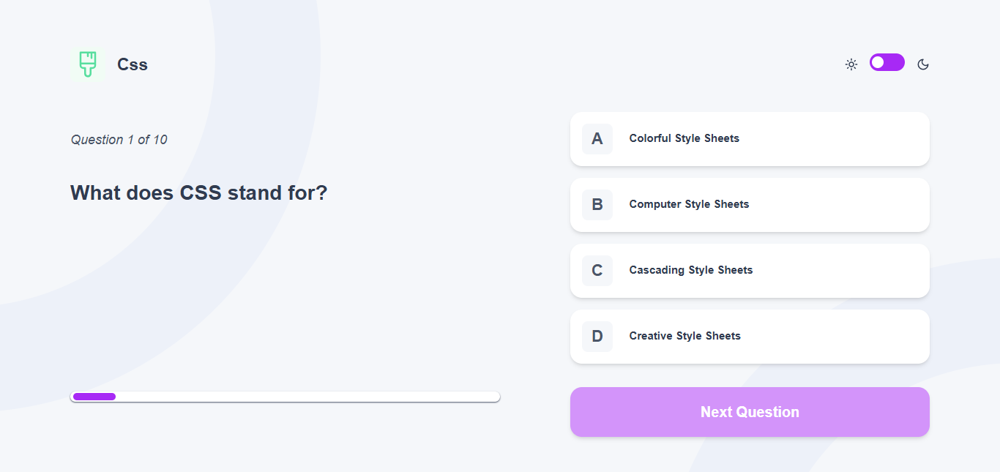

# Frontend Mentor - Frontend quiz app solution

This is a solution to the [Frontend quiz app challenge on Frontend Mentor](https://www.frontendmentor.io/challenges/frontend-quiz-app-BE7xkzXQnU). Frontend Mentor challenges help you improve your coding skills by building realistic projects.

## Table of contents

- [Overview](#overview)
  - [The challenge](#the-challenge)
  - [Screenshot](#screenshot)
  - [Links](#links)
- [My process](#my-process)
  - [Built with](#built-with)
  - [What I learned](#what-i-learned)
- [Author](#author)
- [Acknowledgments](#acknowledgments)

## Overview

### The challenge

Users should be able to:

- Select a quiz subject
- Select a single answer from each question from a choice of four
- See an error message when trying to submit an answer without making a selection
- See if they have made a correct or incorrect choice when they submit an answer
- Move on to the next question after seeing the question result
- See a completed state with the score after the final question
- Play again to choose another subject
- View the optimal layout for the interface depending on their device's screen size
- See hover and focus states for all interactive elements on the page
- Navigate the entire app only using their keyboard
- **Bonus**: Change the app's theme between light and dark

### Screenshot





### Links

- Solution URL: [GitHub Repository](https://github.com/afuhflynn/frontend-quiz-app)
- Live Site URL: [Frontend Quiz App on Vercel](https://frontend-quiz-app.vercel.app)

## My process

### Built with

- Semantic HTML5 markup
- CSS custom properties
- Flexbox
- CSS Grid
- Mobile-first workflow
- [React](https://reactjs.org/) - JS library
- [Zustand](https://zustand-demo.pmnd.rs/) - Global State Management React Library
- [Lucide_React](https://lucide.dev) - Icon Component Library
- [React_Feather](https://feathericons.com/) - Icon Component Library
- [Tailwindcss](https://tailwindcss.com) - For Utility First Classes

### What I learned

- I learned how to implement consistent local storage theme for storing the user preferred theme.
- Implementation of global consistent app state using zustand
- Setting up project and configuring the tailwind.config.js file correctly
- How to write a good README.md file (I very poor at this at the moment)
- I learnt how to write better react.

```js
// Zustand global state management. Very simple and easy to go with
import { create } from "zustand";

export const useAppStore = create((set) => ({
  prefersTheme: "light",
  setPrefersTheme: (value) => {
    set({
      prefersTheme: value,
    });
  },
  quiz: null,
  quizSlug: "",
  setQuizSlug: (value) => {
    set({
      quizSlug: value,
    });
  },
  quizId: "",
  setQuizId: (id) => {
    set({
      quizId: id,
    });
  },
  setQuiz: (quiz) => {
    set({ quiz });
  },
  score: null,
  setScore: (score) => {
    set({
      score,
    });
  },
  quizLogoBgColor: "",
  setQuizLogoBgColor: (value) => {
    set({
      quizLogoBgColor: value,
    });
  },
  questionsCount: null,
  setQuestionsCount: (count) => {
    set({
      questionsCount: count,
    });
  },
}));
```

## Author

Project Created by: **Afuh Flyine Tembeng**

- Website - [AfuhFlynn](https://github.com/afuhflynn)
- Frontend Mentor - [@afuhflynn](https://www.frontendmentor.io/profile/afuhflynn)
- Twitter - [@afuhflynn](https://www.twitter.com/afuhflynn)

## Acknowledgments

I really want to take sometime to thank frontendmentor for their challenges. It has really helped me to be consistent and focused on improving my web dev skills.

## frontend_quiz_app

Quiz page dark


Quiz page light

